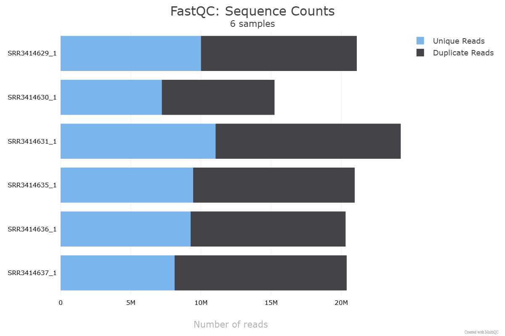
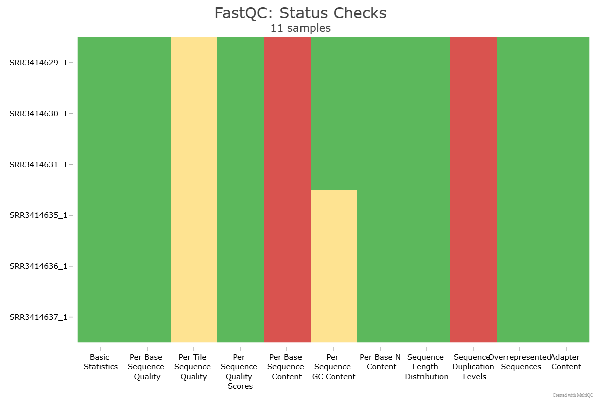

# hse24_hw4
### Садковская Маргарита Алексеевна

[Первая часть гугл коллаб](https://colab.research.google.com/drive/1gAaUKGFxsyrJ3eGj2fRzzaPBw2W8hLkK?usp=sharing)\
[Вторая часть гугл коллаб](https://colab.research.google.com/drive/1JdXfm1LlRAJmDTcI97GUdiwJGVjhwvw8?usp=sharing)

# Часть 1

## Проверка качества чтений по статистике из multiQC

Уровень дупликации варьируется от 52.6% до 60.2%. В процессе перепрограммирования происходят значительные изменения экспрессии генов. Перепрограммированные образцы могут демонстрировать высокую экспрессию ключевых регуляторных генов (например, факторов транскрипции, связанных с плурипотентностью), что приводит к увеличению количества дублированных последовательностей. Аналогично, контрольные образцы могут иметь свои ха
рактерные высокоэкспрессируемые гены

Большинство прочтений кластеризуется около 37, что показывает хорошое качество чтений

Можно, заметить, что сильных отклонений на графике не видно

Большая часть библиотеки (до 40%) состоит из уникальных последовательностей (уровень дупликации 1). Дальше уровень дупликации уменьшается, что является нормальным для большинства данных секвенирования.

## Общая статистика

* Sequence Duplication Levels
  
Все образцы отмечены как проблемные (красный цвет), что указывает на высокий уровень дублированных последовательностей. Это ожидаемо для RNA-seq данных, особенно при высокоэкспрессируемых генах

* Per Base Sequence Content
  
Во всех образцах есть проблемы (красный цвет), что может указывать на смещение содержания нуклеотидов, особенно в начале чтений.

## Таблица с информацией по образцам  
| ID | Тип | Общее число исходных чтений | Число и процент успешно откартированных чтений (не уникальные) | Число и процент успешно откартированных чтений (уникальные) | Общее число чтений, попавших на гены |
|----------|:----------:|:----------------:|:----------------:|:----------------:|:----------------:|
| **SRR3414635** | контрольный | 20956475  | 20715476, 98.85% | 18637053, 87.1% | 16463013 |
| **SRR3414636** | контрольный | 20307147  | 20073615, 98.85% | 18032679, 86.5% | 15942667 |
| **SRR3414637** | контрольный | 20385570  | 20149097, 98.84% | 18043406, 86.3% | 15914380 |
| **SRR3414629** | перепрограммированный | 21106089  | 20863369, 98.86% | 18573565, 88.0% | 16224313 |
| **SRR3414630** | перепрограммированный | 15244711  | 15077019, 98.90% | 13320505, 87.8% | 11583775 |
| **SRR3414631** | перепрограммированный | 24244069  | 23965262, 98.85% | 21159606, 87.5% | 18613501 |

# Часть 2. Анализ дифференциальной экспрессии  с помощью DESeq2

## MA-plot, показывающий Log2FC для генов  

## Тепловая карта зависимости экспрессии генов контрольных и репрограммированных образцов

Тут друг на друга реплики похожи сильнее, чем реплики с другим условием

## Тепловая карта 20 наиболее дифференциально экспрессированных генов

## Графики "Normalized counts" для генов, значимо поменявших свою экспрессию (видно, что точки у перепрограммированых и контрольных образцах имеют сильное отличие)

